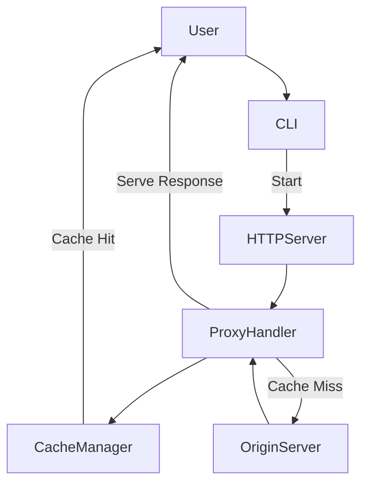

# Caching Proxy CLI Application

## Overview

This project is a CLI-based caching proxy server that intercepts requests from clients, checks for cached responses, and forwards non-cached requests to the origin server. If a response is cached, the server will return the cached response directly. Otherwise, it will fetch the response from the origin server, cache it, and return it to the client.

The application is built using Python and includes a command-line interface (CLI) for configuring and running the proxy server.

## Why a Caching Proxy?

A caching proxy server improves web application performance by reducing the load on the origin server. When multiple clients make requests for the same resource, the proxy can serve cached responses without contacting the origin server repeatedly. This leads to reduced latency, faster response times, and minimized network usage.

### Key Benefits:
- **Reduced Load**: Caching reduces repeated requests to the origin server.
- **Improved Response Times**: Cached responses are served faster.
- **Scalability**: Reduces the need for scaling the origin server by handling frequent requests at the proxy level.

## Why a CLI Tool?

Building the caching proxy as a CLI tool provides flexibility and portability:
- **Ease of Use**: Developers can start and configure the proxy server with simple commands.
- **Portability**: It can be run across various environments and integrated into automation scripts.
- **Customization**: By allowing configuration via command-line arguments, users can define the port, origin URL, and other parameters when launching the proxy.

## Architecture

The architecture consists of several key components:
1. **CLI Interface**: The user starts the caching proxy using CLI commands, specifying the port and origin URL.
2. **ProxyHandler**: This handles incoming HTTP requests and checks if the response is cached. If so, it serves the cached response. Otherwise, it forwards the request to the origin server and caches the response.
3. **Cache Manager**: A custom cache management system that stores and retrieves cached responses.
4. **HTTPServer**: The core Python server that listens for incoming HTTP requests and forwards them to the proxy handler.

View full architecture diagram [here](https://app.eraser.io/workspace/BqxLDyT4Ua2c2rxuYazq?elements=TJfCVrKTpIU9w2tlnZ3gug)

### Flowchart:

